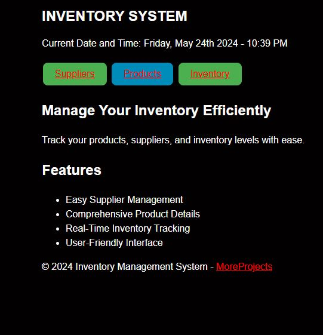

# Inventory Management System

## Table of Contents
1. [Introduction](#introduction)
2. [Installation](#installation)
3. [Usage](#usage)
4. [Features](#features)
5. [Contributing](#contributing)
6. [License](#license)

## Introduction 

The Inventory Management System is a web-based application designed to help businesses manage their inventory efficiently. It allows users to track products, suppliers, and inventory levels, providing real-time insights into stock availability and supply chain management.

## Installation 

To install the Inventory Management System, follow these steps:

1. Clone the repository from GitHub: `https://github.com/ElvisMw/Projects/tree/main/Django/inventory_management`
2. Navigate to the project directory: `cd inventory_management`
3. Install the required dependencies: `pip install -r requirements.txt`
4. Run the migration to set up the database: `python manage.py migrate`
5. Start the development server: `python manage.py runserver`
6. Access the application in your web browser at `http://localhost:8000`

## Usage 

To use the Inventory Management System:

1. Log in to the application using your credentials.
2. Navigate to the desired section (e.g., Products, Suppliers, Inventory).
3. Add, edit, or delete records as needed.
4. Use the search and filter options to find specific items.
5. View reports and analytics to gain insights into inventory performance.

## Features 

The Inventory Management System offers the following features:

- User authentication and authorization
- CRUD operations for products, suppliers, and inventory items
- Search and filter functionality for easy data retrieval
- Real-time updates on inventory levels and stock availability
- Reporting and analytics for inventory performance tracking

## License 

The Inventory Management System is distributed under the [MIT License](LICENSE), which is a free and open-source software license. You are free to use, modify, and distribute the software for any purpose, including commercial use, with no restrictions other than those provided in the license agreement.
